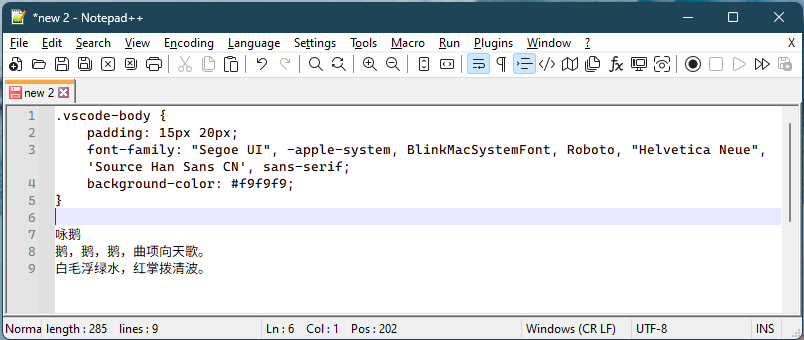

Code-Combo 是由 cascadia mono powerline regular 字体和 dream han sans CN w12 字体合成的字体。所有英文字体字符等宽，中文字体在思源黑体的基础上有些许优化，具体差异可查看源字体说明。

Cascadia 字体仓库在： [Cascadia Code](https://github.com/microsoft/cascadia-code)

Dream Han Sans CN 字体仓库在： [Dream Han CJK](https://github.com/Pal3love/dream-han-cjk)

字体合并方法参考自知乎：[完美字体合并教程](https://zhuanlan.zhihu.com/p/617260598)

## Screenshots

## 使用方法

1. Clone 本仓库或者单独下载 Code-Combo.ttf 文件
2. 安装 Code-Combo.ttf 字体文件到系统
3. 在应用程序内指定该字体

Intermediate 目录是合并字体时临时生成的文件，另外两个文件是源字体文件。

可用于 notepad++、notepad next 或者其他不支持字体 fallback 机制的程序或场景。

## License

遵循源字体文件的 License。